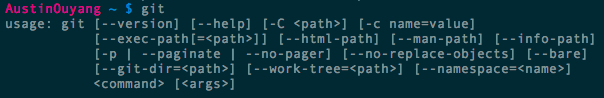
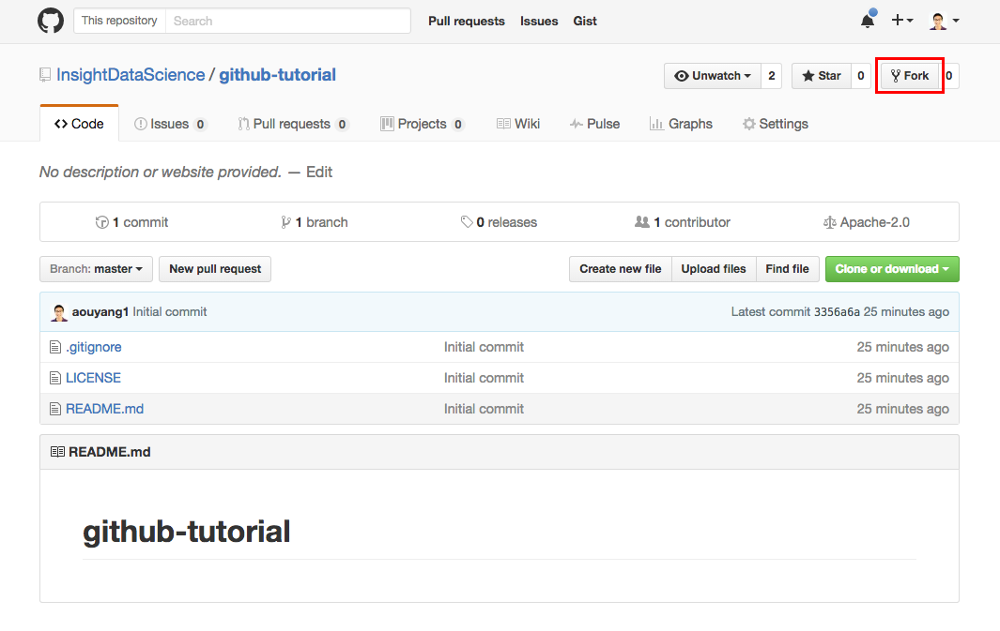
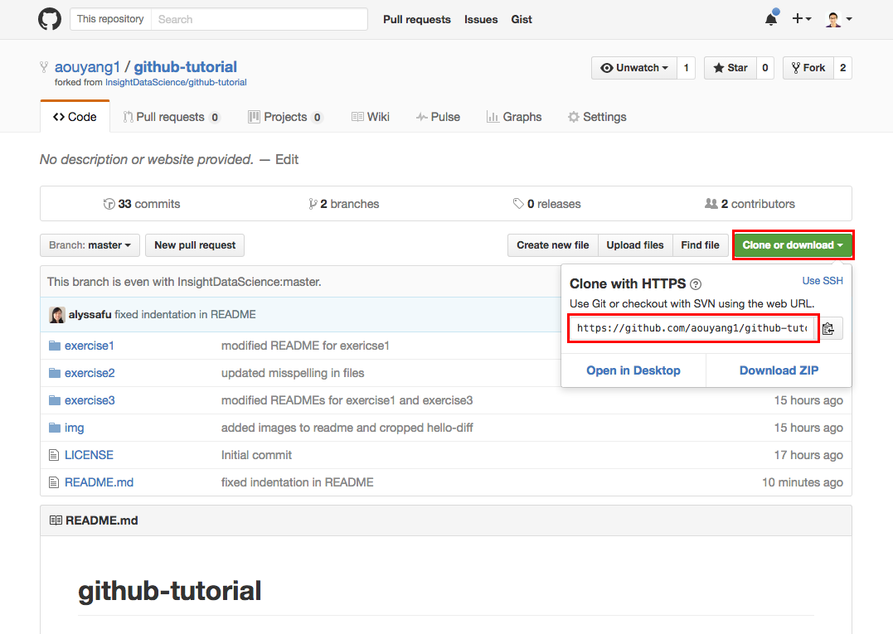
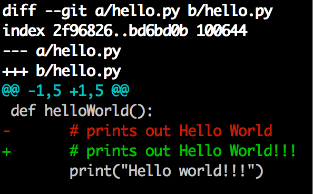
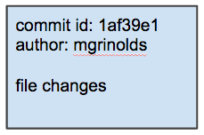
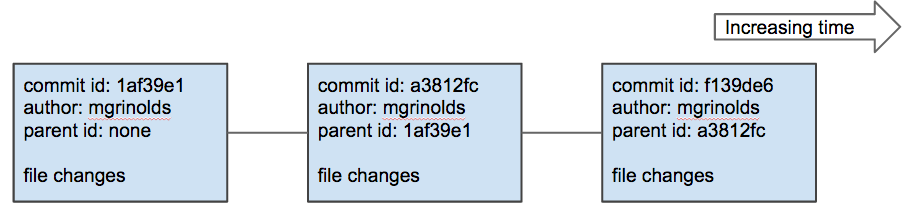

# github-tutorial

# Git and GitHub

### What?
- **Git:** a version control system that keeps track of code changes
- **GitHub:** a popular web-based server for hosting repositories

### Why?
- Keeps a full history of changes
- Allows multiple programmers to work on the same codebase
- Is efficient and lightweight (records file changes, not file contents)
- Public repositories on GitHub can serve as a coding resume.

### How?
- That's what this session is for!

# Git and GitHub Setup

### 1. Create a GitHub account

Create a Github account through the Github website.

- Go to https://github.com/ and follow on-screen instructions to create a user account

- Tip: Choose a job-appropriate user name if possible

<!---->

### 2. Install Git

Install Git on your computer (through Terminal for Mac or Ubuntu).

- Installing on Mac: `$ brew install git`  
- Installing on Ubuntu: `$ apt-get install git`  
- Installing on Windows: [http://git-scm.com/downloads](http://git-scm.com/downloads)

- Tip: If you are running into trouble, try [here](http://git-scm.com/book/en/Getting-Started-Installing-Git)
- Tip: To check if git is already installed, try `$ git` in Terminal



### 3. Configure Git

Configure Git so that Github can recognize your commits (in Terminal).

- Run the following commands in Terminal to configure git:

	`$ git config --global user.name "[insert your user name here]"`  
	`$ git config --global user.email "[insert your email here]"`

- Tip: The gloabl config settings can be accessed and manually edited in `~/.gitconfig`

### 4. Fork the tutorial repository to your account

Fork the tutorial repository to your account through the Github webpage. This makes a copy of the original repository on your account.

- On the [GitHub repo page](https://github.com/InsightDataScience/github-tutorial), in the top right corner of the page under the photo of your account, click the Fork button (see below for example).
- Select your account when prompted. This should fork the github-tutorial repository to your account.

Tip: If you successfully forked the tutorial repository, you should see the name of the repository as [your user name]/github-tutorial



### 5. Clone the repository to your local machine

Clone this repository (the remote repository) to your local machine.

- On your tutorial repository webpage, click the green "Clone or download" button on the right side of the page.
- Select the "Use HTTPS" option if it is available.
- Copy the link.

- In Terminal, navigate to your development folder. (Note: If you don't have a development folder, it may be a good idea to create one where you can store all directories tracked by git in one place.)

	`$ cd [path to your development folder]`

- Type `git clone` into Terminal, followed by the repository link you copied (see below for example)
	  
	`$ git clone [link to your forked tutorial repository]`

<!---->

### You are now ready to use version control with Git and Github!

# Git Concepts and Vocabulary

### Change (aka Diff)

Git maintains version control by tracking the changes or diffs between file versions. 

You can change a file by doing one of two things:  
1. File creation, renaming, or deletion.  
2. Insertion or deletion of a line in a file (a modified line is both an insertion and a deletion)

Git represents insertions or added changes with a `+` and deletions or removed changes with a `-`



Tip: You can use the command `git diff` to see how a file has changed since its last commit or between two branches.

### Commit

Commits are a series of changes that records incremental updates to a series of files.

Each commit a global unique hash (calculated from contents of file) that serves as an identifier.



### Branch

A branch refers to a linear series of commits.

A codebase can be calculated by applying changes to files in each commit in succession.



### Repository

A repository refers to a tree structure that contains many branches. Each branch represents a different state of the code. 

Branches can be formed at any commit, and two branches can be merged together by summing their changes (assuming there are no conflicts).

# Basic Git Tutorial

## Basic Workflow

There are three basic commands that part of the typical workflow when doing version control with git. These commands are **add, commit and push**.

### 0. Create a file

First, create an example file to track using Git.

- In Terminal, navigate to your repository folder.
- Create a Python file called `hello.py` using your favorite editor
- Write some (very simple) code and save the file.

	```
	def hello(name):  
		print("Hello " + name)

	if __name__ == "__main__":
		hello()
	```

### 1. git add

After creating the file, add the file to be tracked using Git.

- In Terminal, use `git add` followed by the filename to add the file to be tracked.

	`$ git add hello.py`

### 2. git commit

After adding the file to be tracked, commit the changes to be tracked using Git.

- In Terminal, use `git commit - m` followed by a short message to commit the changes.

	`$ git commit -m "Initial commit"`

- Tip: Try and make your messages short but meaningful.
- Tip: It is possible, and sometimes encouraged, to add multiple files before making a single commit that encompasses all the changes to those files.

### 3. git push

After commiting the changes, push the changes from your local machine to the remote repository.

- In Terminal, use `git push origin` followed by the name of the branch you are pushing.

	`$ git push origin master`

### Useful Git Commands

There are many other useful Git commands to help you track the status of your files.

`git status` allows you to check the status of your repo, including:
- Which branch you are working on
- Which files are tracked or untracked
- Which files are modified

`git diff` followed by the file name allows you to check the changes to the given file

## Additional Information

### .gitignore

Sometimes there are sensitive (or irrelevant) files that you do not want tracked by Git (e.g., passwords).

Git uses a hidden file called *.gitignore* to indicate which files or file types (e.g., *.pkl, *.ipynb_checkpoints) not to track. After adding file names to the *.gitignore* file, changes made to files that match those names will not be tracked.

Example:

- Create a file called "credentials.json" in the directory of your repository.
- If you run `git status`, you should see "credentials.json" under the untracked files section.
- Create a file called *.gitignore* if it does not exist.
- Add the text "credentials.json" to the *.gitignore* file
- Save and close the *.gitignore* file
- If you run `git status`, "credentials.json" should no longer appear.

It's good practice to add, commit, and push the *.gitignore* file to Github so that your collaborators can see (and add) which files are not being tracked in the repository.

### Create a GitHub Repository

You can create a new repository through the Github webpage.

- From your Github profile on the Github webpage, click on the link, Repositories, located next to Overview.
- Click on the green button labeled "New" located on the right side of the page.
- Create and add a name for your repository.
- Select the option to "Initialize this repository with a README"
- Add a .gitignore file by selecting an option from the dropdown menu.
	- Each option represents a default .gitignore file for the given option.
	- For example, the Python option will by default include *.ipynb_checkpoints

To clone the repository to your local machine, follow the steps outlined earlier.

### Create a new branch

One of the most useful features of Git is the ability to develop on multiple branches.

To **create** a new branch on your local machine, use `git checkout -b` followed by the name of your new branch.  
	`$ git checkout -b add_excitement`

To **add** the new branch to your remote repository, use `git push origin` followed by the name of the branch.  
	`$ git push origin add_excitement`

Use the basic add, commit, and push commands (pointing to this new branch) to develop on this branch.

To **merge** one branch into another, use `git checkout` followed by the branch you want to merge into and `git merge` followed by the branch you are merging into the first branch.
	
	$ git checkout master
	$ git merge add_excitement
	
To **locally delete** the branch, use `git branch -d` followed by the branch name.

To **remotely delete** the branch, use `git push origin --delete` followed by the branch name.

	$ git branch -d add_excitement # local delete
	$ git push origin --delete add_excitement # remote delte

**WARNING:** Performing these delete commands will remove any changes you made to files tracked on these branches. Make sure you have merged any changes you wish to keep into live branches before deleting old branches.

Use `git branch` to see which branch you are currently working on. `git status` also notes which branch you are currently on.

	$ git branch
	$ git status

### Pull Requests

When developing on a team, you rarely merge branches locally (i.e., the process described above).

Typically branches are merged using pull requests (which also includes code review).

A pull request is basically a request to another member of your team to review your code. If they think it looks good, they can accept the pull request (or PR) and merge your branch into another one, such as master or a main feature branch.

#### 1. Create a pull request

Create a pull request by going to the webpage of the Github repository.

- On the Github repository page, click on the "Pull requests" link next to "Code" and "Issues".
- Select the green "New pull request" button on the right side of the page.
- Use the left-most dropdown menu, "base:", to select the branch you want to merge into.
- Use the second dropdown menu, "compare:", to select the branch that you want to merge.
- Click the green "Create pull request" button to access the options to create the pull request.
- Leave a comment if you want to elaborate on the reason for the pull request or provide an update on the changes you made to the branch.
- Click on the gear button next to "Assignees" to assign someone to review and merge the pull request. This has to be someone who is a collaborator on the project.
- Select the green "Create pull request" button to open the pull request.

#### 2. Accept a pull request

On the Github repository webpage, review the pull request, accept changes, and merge the branch.

- To review the pull request, check the "Commits" and "Files changed" options to review the code.
- Within "Files changed", it's possible to add comments to single lines of code by selecting the "+" symbols next to each line. You have the option of submitting single comments or adding them to a review.
- It's possible (but not necessary) to submit a full review by selecting the green "Review changes" button.
- If the changes look good to you, on the "Conversations" tab, select the green "Merge pull request" button.
- Select the green "Confirm merge" button to complete the merge. Add a comment at this stage if you would like to comment on the merge.

#### 3. Delete the merged branch remotely

After merging the branch, it's good practice to delete the working branch to declutter the repository.

- On the pull request webpage, select the grey button called "Delete branch" to delete the merged branch remotely.

#### 4. Delete the merged branch locally

Before deleting the local merged branch, pull the changes into the base branch, then delete the local branch

- In Terminal, switch to the base branch using `git checkout` followed by the name of the base branch.
- Pull the merged changes using `git pull origin` followed by the name of the base branch.
- Delete the merged branch using `git branch -d` followed by the name of the merged branch.
	```
	$ git checkout master
	$ git pull origin master
	$ git branch -d add_excitement
	```

**WARNING:** Remember that when you delete a branch, you delete any of the changes that were tracked on it. Double check that your changes were merged into a live branch before deleting the branch.

## Best Practices

### When should I commit?
Ideally you commit “working” code, so that you can return to a working state if necessary. Also, each commit should have one logical task that can be summarized in one phrase.

### When should I push?
Always right after you commit. Why wouldn’t you want to have an immediate back up?

### Do I have to have commit messages?
You at least need a descriptive title. This is an important part of code documentation (especially in a multi-developer environment).

*Thank you to Mike Grinolds for his slides and GitHub tutorial!*
