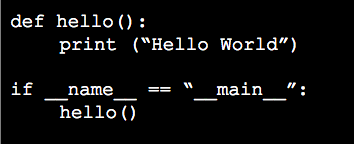
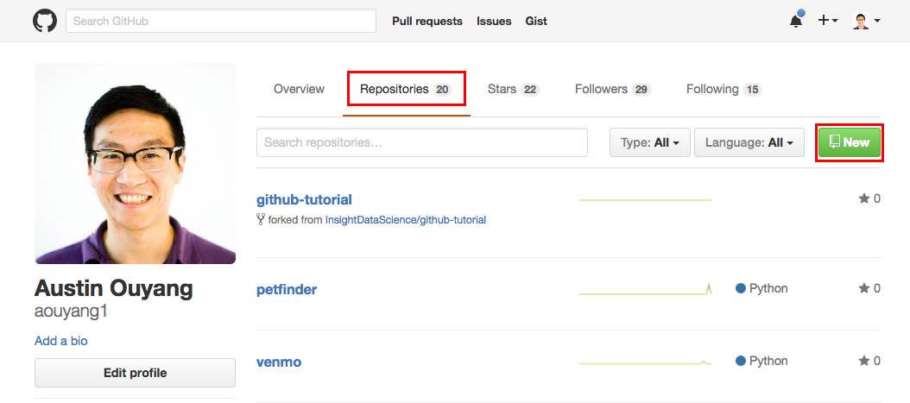
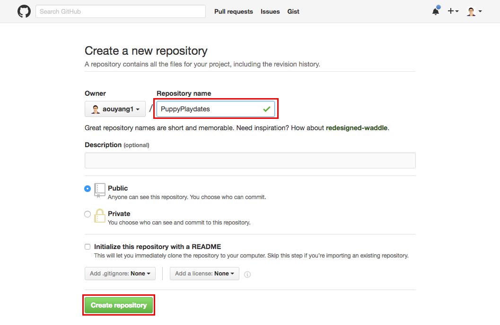
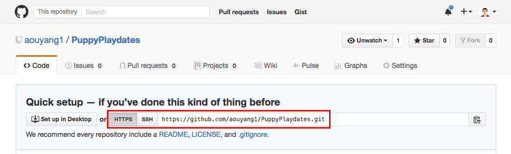
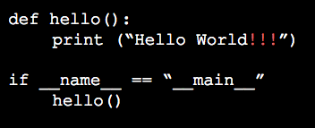

# github-tutorial

# Git and GitHub

### What?
- **Git:** software which keeps track of code changes
- **GitHub:** a popular server for storing repositories

### Why?
- Keeps a full history of changes
- Allows multiple programmers to work on the same codebase
- Is efficient and lightweight (records file changes, not file contents)
- Public repositories on GitHub can serve as a coding resume.

### How?
- That's what this session is for!

# Setting up Git and GitHub

### Installing Git
Git may already be installed. Check to see by running git in a terminal. 

Otherwise:
- Mac: `brew install git`
- Ubuntu: `apt-get install git`
- Windows: http://git-scm.com/downloads
	- Default install options
	- Open the installed Git Bash

If these don't work for any reason, try the other options [here](http://git-scm.com/book/en/Getting-Started-Installing-Git)

### Creating a GitHub account
- Go to https://github.com/
- Choose a job-appropriate user name if possible

### Basic git configuration
- Add your User info, so GitHub recognizes your commits with the following bash commands (and replace Mike's info with your own):  
`$ git config --global user.name "Jill Insight"`  
`$ git config --global user.email "jill.insight@gmail.com"`

These global config settings live in ~/.gitconfig and can also be manually edited there.

### Fork and Git Clone
- Fork the github-tutorial repo by clicking the Fork button in the top right corner of the [GitHub repo page](https://github.com/InsightDataScience/github-tutorial)

- Git clone the repository you just forked to your development folder on your local machine  
`$ git clone https://github.com/jillinsight/github-tutorial.git`

# Git Concepts and Vocabulary

### Change (aka Diff)

One of two things:  
1. File creation, renaming, or deletion.  
2. Insertion or deletion of a line in a file (a modified line is both an insertion and a deletion)

### Commit

A series of changes that records incremental updates to a series of files.

Has a global unique hash (calculated from contents of file) that serves as an identifier.

### Branch

A linear series of commits.

A codebase can be calculated by applying changes to files in each commit in succession.

### Repository

A tree structure containing many branches. Each branch represents a different state of the code. 

Branches can be formed at any commit, and two branches can be merged together by summing their changes (assuming there are no conflicts).

# Basic Git Tutorial

## Basic Workflow

### Add a File to be Tracked by Git
- Create a python file called `hello.py` using your favorite editor (e.g., `nano hello.py`, `vim hello.py`, `subl hello.py`)
- Write some (very simple) code
- Add the file to be tracked by git:  
`$ git add hello.py` 

 

### Commit the Tracked File
- Commit the added file to the git repo and add a message describing the change:  
`$ git commit -m "Initial commit"`  

### Push Updates to a Repository
- Use `git push origin master` to push local commits to the remote branch:  
`$ git push origin master`

### Useful Calls
**git status**
- To check the status of your repo (which branch you're on, which files are untracked, which files are modified, which files are added/tracked), use `git status`  
`$ git status`

**git diff**
- To see how your file has changed before you add/commit the file, use `git diff`  
`$ git diff hello.py`

## Additional Info

### Ignore Files in the Repository
- Sometimes there are sensitive files you do not want tracked to Github (e.g., passwords)
- Add file names to the `.gitignore` file to prevent them from being revision controlled.
- Make a file called `credentials.json` in your directory
- Open (or create) the file `.gitignore` and add `credentials.json` to the file. Save and close.
- Add, commit, and push your changes to the `.gitignore` file:  
`$ git add .gitignore`  
`$ git commit -m "Modifying .gitignore"`  
`$ git push origin master`

### Create a GitHub Repo
- On GitHub create a new repository named `git-demo` by clicking on Respositories, then New from your home page.

- Initialize with a Readme and add a .gitignore

- Now your repo is created! From the home page of your repo, copy the repo URL. 

- Clone the repo to your development folder on your local machine.  
`$ git clone https://github.com/jillinsight/git-demo.git`

### Developing on a new branch
*Create a new branch locally*
- To create a new branch, use the following command. Replace `add-excitement` with the name of your new branch  
`$ git checkout -b add-excitement`

*Push the new branch to remote*  
- Push the new branch to remote  
`$ git push origin add-excitement`

*Commit to a new branch*
- Make a change to `hello.py` by adding exclamation points after "Hello World"
- After making this change, push your changes to the new branch  
`$ git add hello.py`  
`$ git commit -m "Add excitement to hello world"`  
`$ git push origin add-excitement`

*Merge a new branch*
- Checkout the branch you want to merge into (preferably the branch you created the new branch off of)
- Merge the changed branch into that branch  
`$ git checkout master`  
`$ git merge add-excitement`

*Delete the new branch*
- If you are done developing on the new branch, delete the branch locally and remotely  
`$ git branch -d add-excitement # local delete`  
`$ git push origin --delete add-excitement # remote delete`

*Git Branch*
- To see which branch you're on, use `git branch` or `git status`

### Pull Requests

*Create a pull request*
- When developing on a team, you rarely merge branches locally. You will typically merge branches via pull requests.
- On the GitHub repo, click on Pull requests from the options.
- Click the New pull request button
- From the dropdown menu, select the branch you want to serve as your base (the branch you will merge into). Select the branch you want to merge from the compare dropdown.
- Click Create pull request.
- Assign someone to review your code and click Create pull request

*Accept a pull request*
- If you are reviewing a pull request, check out the Commits and Files changed to view diffs between the base branch and compare branch.
- If you are happy with the changes (and there are no conflicts), click Merge pull request and Confirm request. (Don't forget to add a comment telling your co-developer what an awesome job they did!)
- Delete the branch if it is no longer needed (remotely)

*Pull changes to local*
- Don't forget to pull the changed branch back down to your local machine after a pull request is made. Replace master with the branch you merged into.  
`$ git pull origin master`

*Delete the local branch*
- If you deleted the remote branch, delete the local branch

## Best Practices

### When should I commit?
Ideally you commit “working” code, so that you can return to a working state if necessary. Also, each commit should have one logical task that can be summarized in one phrase.

### When should I push?
Always right after you commit. Why wouldn’t you want to have an immediate back up?

### Do I have to have commit messages?
You at least need a descriptive title. This is an important part of code documentation (especially in a multi-developer environment).

*Thank you to Mike Grinolds for his slides and GitHub tutorial!*
